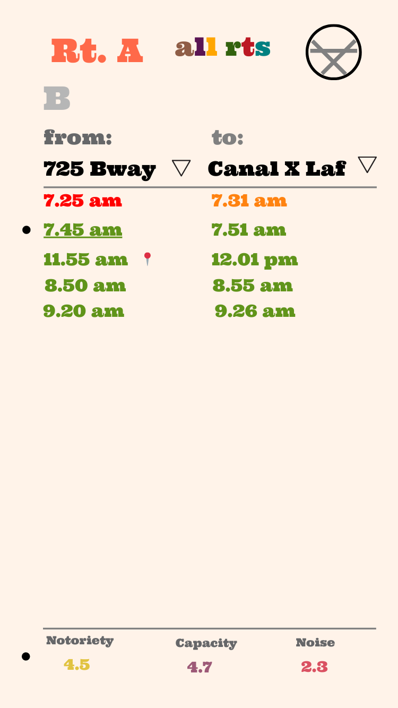

# NYU Routes

Developing of the Web App version of NYU Shuttle

Being a student in the city of New York can be hectic.
Expecially being a student whose campus is NYC can be frustrating, with trying to catch the bus, trying to get coffee before catching the bus, trying to plan when to do groceries so that you get home in time.

NYU Shuttle is the go to app for all your bus needs.

_The iOS version of the app was developed. And here is the Android. With a few more features and personalization added._

## Development notes:

I intend for the application to be just one page - and in essense - a static Progressive Web Application that can be installed and used on any device

**1. Design**
The design was two fold (a) how it would look on desktop browser and (b) how it would look on a mobile browser.

**_Web app_**

**_Mobile site_**

**2. The Data**
Since all the routes are contained in spreadsheets and updated rarely within the school year, all the route information will be loaded into the application and updated whenever the routes change.

**3. Personalization**
In order to personalize the application, I intend to use cached memory. I still have to do more research and testing

**4. Future work**
Future work will include:

1. -[ ] Incorporating sign in to incorporate more personalize the applicaiton to each individual user. And to do this, I will have to
2. -[ ] build the server side application
3. -[ ] Build the Native application
